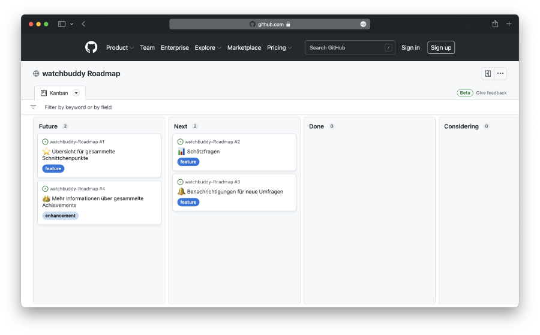

# watchbuddy Roadmap

Wir möchten euch hier über geplante und bereits abgeschlossene Funktionen für watchbuddy informieren.

[**Hier geht's zur Roadmap**](https://github.com/orgs/PietSmietde/projects/3/views/1)

## Bugmeldungen

Schreibe bei Problemen mit der App bitte eine E-Mail an [watchbuddy@pietsmiet.de](mailto:watchbuddy@pietsmiet.de).

Eine genaue Beschreibung des Problems hilft uns bei der Behebung:
- Welches Gerät verwendest du? (Hersteller, Betriebssystem, Version)
- Welche Version der App hast du installiert?
  - Hast du versucht, die Daten der App in den Systemeinstellungen zu löschen?
- Hast du versucht, die App neu zu installieren?
- Was passiert bei dem vorliegenen Problem?
  - Was sollte eigentlich passieren?
  - Erscheint einer Fehlermeldung?
  - Stürzt die App ab?
- Screenshots/Videos helfen uns bei der lokalisierung des Fehlers
